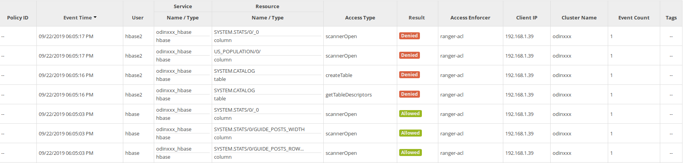
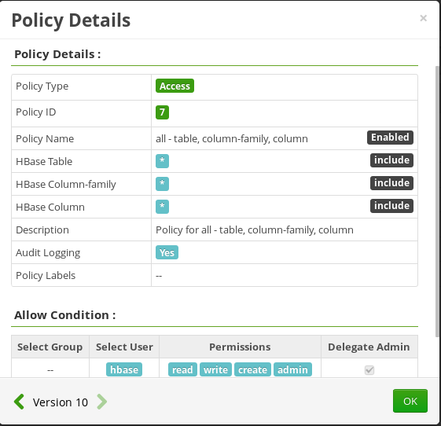
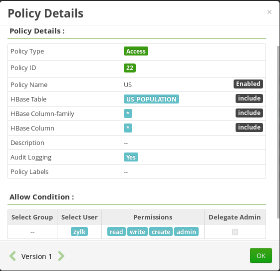
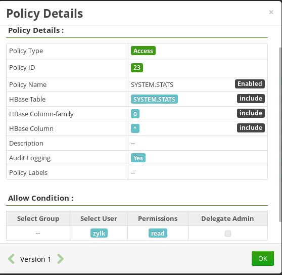

## Ejemplo de accceso a hbase usando Phoenix con identificación de usuario

El problema que se está intentando resolver es trasldadar la indentidad a la capa de phoenix en un cluster que no tienen activado Kerberos.

 * Las pruebas realizadas usando el PQS no han funcionado correctamente, en teoría con el prámetro doAs debería funcionar pero no funciona
 * Se ha optado por realizar la conexión usando el driver directo, no el de PSQ. Este driver se conecta a zookeeper en vez de hacer uso del PQS
 
 
### JDBC contra zooekeeper
 
Preparamos la conexión conociendo
 * Zookeeper qurorum
 * Hbase zookeeper base path
 
```java
final String ZK_PORT = "2181";
final String ZK_HOST = "odin003.bigdata.zylk.net";
final String ZK_PATH = "/hbase-unsecure";
//jdbc:phoenix:m1.hdp.local,m2.hdp.local,d1.hdp.local:2181:/hbase-unsecure
final String url = "jdbc:phoenix:" + ZK_HOST +":"+ ZK_PORT+":"+ZK_PATH;
```
 
Una vez tenemos preparada la conexión la ejecutamos usando el objeto UserGroupInformation que nos permite obtener la identidad remota de un usuarios y ejectura la conexión como si fueras dicho usuario. Al hacerlo así las politicas de ranger que se tengan aplicadas a las tablas de HBase tienen efecto, así como el modelo de auditoría.

```java
UserGroupInformation user2Ugi = UserGroupInformation.createRemoteUser("hbase", null);
user2Ugi.doAs(new PrivilegedExceptionAction<Void>() {
			@Override
			public Void run() throws Exception {
				try (Connection conn = DriverManager.getConnection(url); Statement stmt = conn.createStatement()) {
					conn.setAutoCommit(true);
					try (ResultSet rs = stmt.executeQuery("select STATE,CITY,POPULATION from US_POPULATION")) {
						while (rs.next()) {
							result.add(rs.getString("STATE"));
						}
					} 
				} 
				return null;
			}
		});
```

En este ejemplo se usa el usuario para ejecutar la acción con un doAs. Otra altenativa es trasladar al contexto de la JVM la identidad del usuario remoto

```java
UserGroupInformation user2Ugi = UserGroupInformation.createRemoteUser("hbase", null);
UserGroupInformation.setLoginUser(user2Ugi);
final List<String> result = new ArrayList<>();
long t0 = System.currentTimeMillis();
try (Connection conn = DriverManager.getConnection(url); Statement stmt = conn.createStatement()) {
	conn.setAutoCommit(true);
	try (ResultSet rs = stmt.executeQuery("select STATE,CITY,POPULATION from US_POPULATION")) {
		while (rs.next()) {
			result.add(rs.getString("STATE"));
		}
	} 
} 
```

 

Puede que se tengan que gestionar los parámetros del core-site para que se pueden impersonar los usuarios y las máquinas desde las que se hace el login

```properties
hadoop.proxyuser.hbase.groups=*
hadoop.proxyuser.hbase.hosts=*
```

Para probar el ejemplo hay que crear una tabla en Phoenix y ver que usando el usuario hbase se puede acceder y que con un id de usuario que no existe (hbase2) el sistema no permite acceder

 


Las políticas deben estar creadas de manera similar lo siguiente:

Hbase como administrador general



Un segundo usuario, en este caso zylk, con acceso a la tabla **US_POPULATION** Para ello debe tener permisos de lectura sobre la tabla en cuestión 



y sobre la tabla de phoenix **SYSTEM.STATS**


 
